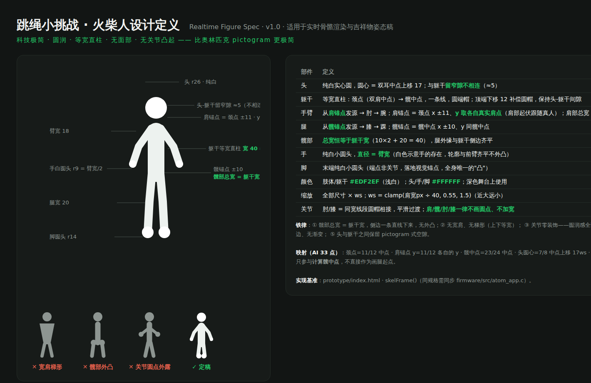

# AI 火柴人渲染说明（含关键点接口）

> 对象:AI 管线团队 + 端上工程。实现基准:[`demo.html`](demo.html) 的 `skelFrame()`;交互演示见 [demo.html](demo.html)「火柴人渲染说明」页签。



## 1. 关键点接口(BP-28 自研拓扑,AI 后台实际输出)

`feedPose(pts)`(C:`atom_app_feed_pose`):**BP-28 拓扑,28 个关键点**(对应后台 `KeypointNameEnum`),归一化 0–1、原点左上,推流 **15–20Hz**(渲染循环 10–15fps 取最新帧,丢帧无碍);500ms 无整帧数据自动回落内置模拟动作。每点 `{x, y, v?}`(v = 置信度,可选)。

**镜像(已确认)= 照镜子**:用户举右手 → 火柴人画面**右侧**的手抬起。即正对镜头时 **r\* 点的 x 大于 l\* 点的 x**;翻转由 AI 管线在喂入前完成,渲染端不再做任何翻转。

**关键点短暂缺失(已确认)= 端上自动补间**:feed 层对单点缺失**保持最近有效值 ≤400ms**(补间-保持,肉眼无感);超时该部件隐藏、其余部件照常;整帧断流 500ms 回落模拟。

**BP-28 的优势**:肩中(7)/髋中(6)/颈(8)/头(9)等**中心点由后端直出**,渲染端不再需要求左右中点——几何更稳、代码更省。

渲染使用的 15 个点(+2 个可选):

| 索引 | 部位(enum) | 渲染用途 |
|---|---|---|
| 9 | 头 head | **直接作头圆心**(r26ws),无需派生 |
| 7 | 肩中 sho | 躯干柱顶(下移 12ws 补偿圆帽)+ 肩锚点 x 基准 |
| 6 | 髋中 hip | 躯干柱底 + 髋锚点 x 基准 |
| 12 / 13 | 右肩 rSho / 左肩 lSho | **各自的 y = 手臂起点高度**(肩部起伏跟随真人);两点距离 = 缩放标尺 ws |
| 11 / 14 | 右肘 rElb / 左肘 lElb | 手臂中继点 |
| 10 / 15 | 右腕 rWri / 左腕 lWri | 手臂终点 + 手白圆头(r9ws)+ 虚拟绳两端挂点 |
| 2 / 3 | 右髋 rHip / 左髋 lHip | **各自的 y = 腿起点高度**(髋部起伏跟随真人,与肩同规则) |
| 1 / 4 | 右膝 rKnee / 左膝 lKnee | 腿中继点 |
| 0 / 5 | 右踝 rAnk / 左踝 lAnk | 腿终点 + 脚白圆头(r14ws) |
| 21 / 18 | 右脚跟 rHeel / 左脚跟 lHeel(可选) | **触地涟漪落点**(真实触地,缺省回落双踝) |

**不渲染**(接口兼容接收):脚 16/19 · 脚趾 17/20 · 腰椎 22 · 指尖 23–26 · 鼻 27。颈(8)作头点缺失时的回落参考。

**已确认**:① 镜像=照镜子(见上);② 单点缺失端上补间保持;③ 推流 15–20Hz。**仍待确认**:④ head(9) 语义是头心还是头顶(当前按头心渲染,若为头顶则圆心下移 r/2);⑤ `v` 置信度字段的具体约定(有无/阈值)。

**计数管线独立**:`onJump()` 由 AI 判定触发,骨骼流只负责渲染;两者同帧到达时,计数动画/涟漪/发光与骨骼姿态自然对齐。

## 2. 视口变换(固定 2/3 视口)

整个相机帧固定缩至 2/3、底边居中锚定——**顶部 1/3 永久让给计数数字**,骨骼在帧内的真实位置关系原样保留(不播相机画面):

```
x' = 0.5 + (x − 0.5) × ⅔
y' = 0.94 − (1 − y) × ⅔        // 底边锚在 0.94,双脚与贴边环保持安全间距
屏幕坐标 = (x', y') × 466
```

## 3. 缩放标尺

所有几何尺寸 × ws,近大远小:

```
ws = clamp(肩点间距px ÷ 40, 0.55, 1.5)
```

## 4. 火柴人几何(基准 ws=1,全部圆端帽)

| 部件 | 定义 | 值 |
|---|---|---|
| 头 | 纯白实心圆,圆心 = **头部点(9)直接使用**;与躯干留窄隙(≈5)不相连 | r 26 |
| 躯干 | 等宽直柱:**肩中(7)→ 髋中(6)**一条线(后端直出中心点);顶端下移 12 补偿圆帽 | 宽 40 = 2×腿宽 |
| 手臂 | 肩锚点(肩中 x ±11、y 取各自真实肩点 12/13)→ 肘(11/14)→ 腕(10/15) | 宽 18 |
| 腿 | 髋锚点(髋中 x ±10、**y 取各自真实髋点 2/3**)→ 膝(1/4)→ 踝(0/5) | 宽 20 |
| 手 | 纯白圆头,直径 = 臂宽(不外凸) | r 9 |
| 脚 | 纯白圆头,微大于腿半宽(落地锚点,全身唯一的"凸") | r 14 |
| 颜色 | 肢体/躯干 #EDF2EF;头/手/脚 #FFFFFF | — |

**铁律**:肩部总宽 = 髋部总宽 = 躯干宽 40(锚点内收,四肢外缘与躯干侧边齐平);无宽肩、无梯形、无关节圆点、无面部、无描边;圆润感全部来自"等宽线 + 圆端帽"。

## 5. 伴随动效(与计数同帧)

- **虚拟绳**:相位振荡器,转速 = 跳跃间隔 EMA;每次 `onJump()` 把相位向"绳过脚下"软校正 40%;腕点为两端,二次贝塞尔;下半周画在人前/上半周在人后;3 条残影弧抗 15fps 频闪;绳色 8 色池(开轮随机、每满 50 换色);不跳 1.2s 后 0.7s 淡出;
- **触地涟漪**:仅计数落地触发,落点 = **双脚跟(18/21)中点**(真实触地,缺省回落双踝 0/5);单个透视椭圆(ry=0.3rx),0 帧金色最强,0.7s 爆发扩张-压缩-回弹-消失;
- **逢十发光**:全身金色辉光(shadowBlur 26×ws)+ 身体转纯白,0.5s 衰减;嵌入式无 shadowBlur 时用"底层加粗半透明描边"两遍绘制等效;
- 500ms 无骨骼数据 → 内置模拟动作(2.3Hz 跳跃周期 + 漫游漂移),接口层无感切换。

## 6. 性能要求

骨骼渲染延迟 <100ms;目标帧率 10–15fps(渲染循环间隔随设备帧率设定);嵌入式参考实现见 [`code/`](../code/)。
