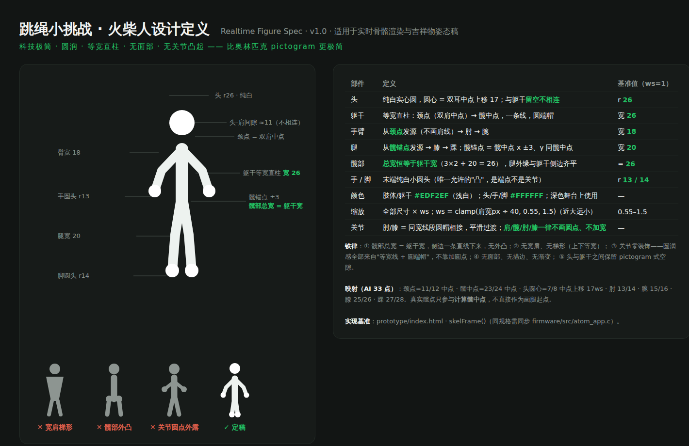

# AI 火柴人渲染说明（含关键点接口）

> 对象:AI 管线团队 + 端上工程。实现基准:[`demo/index.html`](../demo/index.html) 的 `skelFrame()`;
> 可视规格卡:[`figure-spec.html`](figure-spec.html)(PNG 版见下图)。



## 1. 关键点接口

`feedPose(pts)`(C:`atom_app_feed_pose`):**MediaPipe Pose 33 点拓扑**,归一化 0–1、原点左上、**喂入前完成镜像**,建议 ≥15Hz;500ms 无数据自动回落内置模拟动作。每点 `{x, y, v?}`(v = 置信度,可选)。

渲染实际使用的 13 个点:

| 索引 | 部位 | 渲染用途 |
|---|---|---|
| 7 / 8 | 左耳 / 右耳 | 中点上移 17ws = 头圆心(r26ws) |
| 11 / 12 | 左肩 / 右肩 | 中点 = 颈点(躯干顶);**各自的 y = 手臂起点高度**(肩部起伏跟随真人);两点距离 = 缩放标尺 |
| 13 / 14 | 左肘 / 右肘 | 手臂中继点 |
| 15 / 16 | 左腕 / 右腕 | 手臂终点 + 手白圆头(r9ws)+ 虚拟绳两端挂点 |
| 23 / 24 | 左髋 / 右髋 | **仅取中点** = 躯干底 + 髋锚点参考(真实髋点不直接作画腿起点) |
| 25 / 26 | 左膝 / 右膝 | 腿中继点 |
| 27 / 28 | 左踝 / 右踝 | 腿终点 + 脚白圆头(r14ws)+ 触地涟漪落点 |

其余 20 点(面部/手指/脚跟等)接口兼容接收,渲染不使用。

**计数管线独立**:`onJump()` 由 AI 判定触发,骨骼流只负责渲染;两者同帧到达时,计数动画/涟漪/发光与骨骼姿态自然对齐。

## 2. 视口变换(固定 2/3 视口)

整个相机帧固定缩至 2/3、底边居中锚定——**顶部 1/3 永久让给计数数字**,骨骼在帧内的真实位置关系原样保留(不播相机画面):

```
x' = 0.5 + (x − 0.5) × ⅔
y' = 0.94 − (1 − y) × ⅔        // 底边锚在 0.94,双脚与贴边环保持安全间距
屏幕坐标 = (x', y') × 466
```

## 3. 缩放标尺

所有几何尺寸 × ws,近大远小:

```
ws = clamp(肩点间距px ÷ 40, 0.55, 1.5)
```

## 4. 火柴人几何(基准 ws=1,全部圆端帽)

| 部件 | 定义 | 值 |
|---|---|---|
| 头 | 纯白实心圆,圆心 = 双耳中点上移 17;与躯干留窄隙(≈5)不相连 | r 26 |
| 躯干 | 等宽直柱:颈点 → 髋中点一条线;顶端下移 12 补偿圆帽 | 宽 40 = 2×腿宽 |
| 手臂 | 肩锚点(颈点 x ±11、y 取各自真实肩点)→ 肘 → 腕 | 宽 18 |
| 腿 | 髋锚点(髋中点 x ±10、y 同髋中点)→ 膝 → 踝 | 宽 20 |
| 手 | 纯白圆头,直径 = 臂宽(不外凸) | r 9 |
| 脚 | 纯白圆头,微大于腿半宽(落地锚点,全身唯一的"凸") | r 14 |
| 颜色 | 肢体/躯干 #EDF2EF;头/手/脚 #FFFFFF | — |

**铁律**:肩部总宽 = 髋部总宽 = 躯干宽 40(锚点内收,四肢外缘与躯干侧边齐平);无宽肩、无梯形、无关节圆点、无面部、无描边;圆润感全部来自"等宽线 + 圆端帽"。

## 5. 伴随动效(与计数同帧)

- **虚拟绳**:相位振荡器,转速 = 跳跃间隔 EMA;每次 `onJump()` 把相位向"绳过脚下"软校正 40%;腕点为两端,二次贝塞尔;下半周画在人前/上半周在人后;3 条残影弧抗 15fps 频闪;绳色 8 色池(开轮随机、每满 50 换色);不跳 1.2s 后 0.7s 淡出;
- **触地涟漪**:仅计数落地触发,落点 = 双踝中点;单个透视椭圆(ry=0.3rx),0 帧金色最强,0.7s 爆发扩张-压缩-回弹-消失;
- **逢十发光**:全身金色辉光(shadowBlur 26×ws)+ 身体转纯白,0.5s 衰减;嵌入式无 shadowBlur 时用"底层加粗半透明描边"两遍绘制等效;
- 500ms 无骨骼数据 → 内置模拟动作(2.3Hz 跳跃周期 + 漫游漂移),接口层无感切换。

## 6. 性能要求

骨骼渲染延迟 <100ms;目标帧率 10–15fps(渲染循环间隔随设备帧率设定);嵌入式参考实现见 [`embedded/`](../embedded/)。
